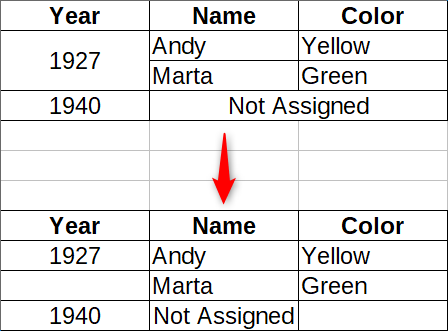

<!-- TOC -->

- [htmltable2flatgrid](#htmltable2flatgrid)
    - [Why I need it](#why-i-need-it)
    - [How to use it](#how-to-use-it)
    - [Notes](#notes)
    - [Output markdown preview](#output-markdown-preview)

<!-- /TOC -->

# htmltable2flatgrid

It's a **Python 3** script whose goal is to **convert** an **HTML table** with **colspan** and **rowspan**, in a clean CSV file with all **cells** properly **splitted** (as in the image below).

This script is a clone of the one you find in this great post of **John Ricco**: https://johnricco.github.io/2017/04/04/python-html/

I changed the John's one slightly:

- I have added **`strip()`** function to clean the text of the table cells;
- I want to use it as **command-line** utiliy.

## Why I need it

Because I do not find a Python module (or a command-line utility) able to extract properly a CSV table from an HTML table with **colspan** and **rowspan** (i R you have it, but I'm not a R user).

## How to use it

The current mode to use it is:

- download the [python script](./htmltable2flatgrid.py) and give it execution permission;
- run it using the two arguments it needs: the source URL and the index of the table (starting at 0) which identifies which one in the HTML source should be returned (in a single webpage you can have more than one table).

In example to extract the data from the twelfth table of "Academy Award for Best Picture" Wikipedia page -  https://en.wikipedia.org/wiki/Academy_Award_for_Best_Picture - the command is (I have cloned it [here](https://aborruso.github.io/htmltable2flatgrid/exampleInput/)):

    ./htmltable2flatgrid.py "https://aborruso.github.io/htmltable2flatgrid/exampleInput/" 11

In output you will have [this CSV](./exampleOutput/table.csv) (below a markdown preview).

## Notes

- I have not tested it with an HTML page badly formatted;
- the script does not check if the source webpage is reachable.

## Output markdown preview

| 0 | 1 | 2 |
| --- | --- | --- |
| Year | Film | Film Studio |
| 2010(83rd) |  |  |
|  | The King's Speech | Iain Canning, Emile Sherman, and Gareth Unwin |
|  | 127 Hours | Danny Boyle, John Smithson, and Christian Colson |
|  | Black Swan | Scott Franklin, Mike Medavoy, and Brian Oliver |
|  | The Fighter | David Hoberman, Todd Lieberman, and Mark Wahlberg |
|  | Inception | Christopher Nolan and Emma Thomas |
|  | The Kids Are All Right | Gary Gilbert, Jeffrey Levy-Hinte, and Celine Rattray |
|  | The Social Network | Dana Brunetti, Ceán Chaffin, Michael De Luca, and Scott Rudin |
|  | Toy Story 3 | Darla K. Anderson |
|  | True Grit | Joel Coen, Ethan Coen, and Scott Rudin |
|  | Winter's Bone | Alix Madigan and Anne Rosellini |
| 2011(84th) |  |  |
|  | The Artist | Thomas Langmann |
|  | The Descendants | Jim Burke, Alexander Payne, and Jim Taylor |
|  | Extremely Loud & Incredibly Close | Scott Rudin |
|  | The Help | Brunson Green, Chris Columbus, and Michael Barnathan |
|  | Hugo | Graham King and Martin Scorsese |
|  | Midnight in Paris | Letty Aronson and Stephen Tenenbaum |
|  | Moneyball | Michael De Luca, Rachael Horovitz, and Brad Pitt |
|  | The Tree of Life | Sarah Green, Bill Pohlad, Dede Gardner, and Grant Hill |
|  | War Horse | Steven Spielberg and Kathleen Kennedy |
| 2012(85th) |  |  |
|  | Argo | Grant Heslov, Ben Affleck, and George Clooney |
|  | Amour | Margaret Menegoz, Stefan Arndt, Veit Heiduschka, and Michael Katz |
|  | Beasts of the Southern Wild | Dan Janvey, Josh Penn, and Michael Gottwald |
|  | Django Unchained | Stacey Sher, Reginald Hudlin, and Pilar Savone |
|  | Les Misérables | Tim Bevan, Eric Fellner, Debra Hayward, and Cameron Mackintosh |
|  | Life of Pi | Gil Netter, Ang Lee, and David Womark |
|  | Lincoln | Steven Spielberg and Kathleen Kennedy |
|  | Silver Linings Playbook | Donna Gigliotti, Bruce Cohen, and Jonathan Gordon |
|  | Zero Dark Thirty | Mark Boal, Kathryn Bigelow, and Megan Ellison |
| 2013(86th) |  |  |
|  | 12 Years a Slave | Brad Pitt, Dede Gardner, Jeremy Kleiner, Steve McQueen, and Anthony Katagas |
|  | American Hustle | Charles Roven, Richard Suckle, Megan Ellison, and Jonathan Gordon |
|  | Captain Phillips | Scott Rudin, Dana Brunetti, and Michael De Luca |
|  | Dallas Buyers Club | Robbie Brenner and Rachel Winter |
|  | Gravity | Alfonso Cuarón and David Heyman |
|  | Her | Megan Ellison, Spike Jonze, and Vincent Landay |
|  | Nebraska | Albert Berger and Ron Yerxa |
|  | Philomena | Gabrielle Tana, Steve Coogan, and Tracey Seaward |
|  | The Wolf of Wall Street | Martin Scorsese, Leonardo DiCaprio, Joey McFarland, and Emma Tillinger Koskoff |
| 2014(87th) |  |  |
|  | Birdman or (The Unexpected Virtue of Ignorance) | Alejandro G. Iñárritu, John Lesher, and James W. Skotchdopole |
|  | American Sniper | Clint Eastwood, Andrew Lazar, Robert Lorenz, Bradley Cooper, and Peter Morgan |
|  | Boyhood | Richard Linklater and Cathleen Sutherland |
|  | The Grand Budapest Hotel | Wes Anderson, Scott Rudin, Steven M. Rales, and Jeremy Dawson |
|  | The Imitation Game | Nora Grossman, Ido Ostrowsky, and Teddy Schwarzman |
|  | Selma | Christian Colson, Oprah Winfrey, Dede Gardner, and Jeremy Kleiner |
|  | The Theory of Everything | Tim Bevan, Eric Fellner, Lisa Bruce, and Anthony McCarten |
|  | Whiplash | Jason Blum, Helen Estabrook, and David Lancaster |
| 2015(88th) |  |  |
|  | Spotlight | Blye Pagon Faust, Steve Golin, Nicole Rocklin, and Michael Sugar |
|  | The Big Short | Dede Gardner, Jeremy Kleiner, and Brad Pitt |
|  | Bridge of Spies | Steven Spielberg, Marc Platt, and Kristie Macosko Krieger |
|  | Brooklyn | Finola Dwyer and Amanda Posey |
|  | Mad Max: Fury Road | Doug Mitchell and George Miller |
|  | The Martian | Simon Kinberg, Ridley Scott, Michael Schaefer, and Mark Huffam |
|  | The Revenant | Arnon Milchan, Steve Golin, Alejandro G. Iñárritu, Mary Parent, and Keith Redmon |
|  | Room | Ed Guiney |
| 2016(89th) |  |  |
|  | Moonlight | Adele Romanski, Dede Gardner, and Jeremy Kleiner |
|  | Arrival | Shawn Levy, Dan Levine, Aaron Ryder, and David Linde |
|  | Fences | Scott Rudin, Denzel Washington, and Todd Black |
|  | Hacksaw Ridge | Bill Mechanic and David Permut |
|  | Hell or High Water | Carla Hacken and Julie Yorn |
|  | Hidden Figures | Donna Gigliotti, Peter Chernin, Jenno Topping, Pharrell Williams, and Theodore Melfi |
|  | La La Land | Fred Berger, Jordan Horowitz, and Marc Platt |
|  | Lion | Emile Sherman, Iain Canning, and Angie Fielder |
|  | Manchester by the Sea | Matt Damon, Kimberly Steward, Chris Moore, Lauren Beck, and Kevin J. Walsh |
| 2017(90th) |  |  |
|  | The Shape of Water | Guillermo del Toro and J. Miles Dale |
|  | Call Me by Your Name | Peter Spears, Luca Guadagnino, Emilie Georges, and Marco Morabito |
|  | Darkest Hour | Tim Bevan, Eric Fellner, Lisa Bruce, Anthony McCarten, and Douglas Urbanski |
|  | Dunkirk | Emma Thomas and Christopher Nolan |
|  | Get Out | Sean McKittrick, Jason Blum, Edward H. Hamm Jr., and Jordan Peele |
|  | Lady Bird | Scott Rudin, Eli Bush, and Evelyn O'Neill |
|  | Phantom Thread | JoAnne Sellar, Paul Thomas Anderson, Megan Ellison, and Daniel Lupi |
|  | The Post | Amy Pascal, Steven Spielberg, and Kristie Macosko Krieger |
|  | Three Billboards Outside Ebbing, Missouri | Graham Broadbent, Pete Czernin, and Martin McDonagh |

